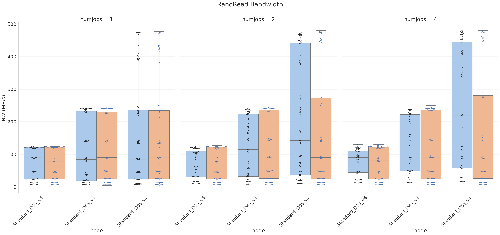
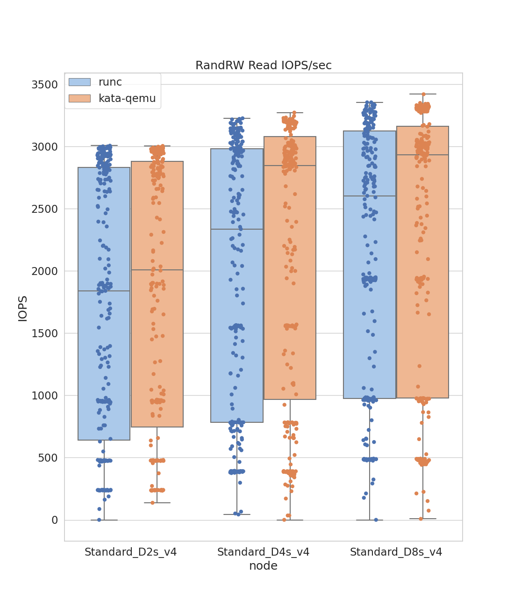

# aks-benchmark-fio
Analysis of IO performance in AKS using fio benchmark tool

## Prerequisites

This repository has been tested on Ubuntu 20.04. There shouldn't be much issues with Ubuntu 18.04.
It has not been tested on Windows.

1. Install python3.
2. Install modules necessary for data visualization: `pip3 install seaborn pandas matplotlib`
3. Install Azure CLI (`az`) following the instructions at [Prerequisites](https://docs.microsoft.com/en-us/azure/aks/learn/quick-kubernetes-deploy-cli#prerequisites)
4. Login using `az login`
5. Install kubectl locally using the az aks install-cli command: `az aks install-cli`

## Running the benchmarks

1. Clone the repository using git and cd to it.
2. Login to Azure using `az login`
3. Create a new resource group and choose your location. This benchmark was run in "Central US" location.
4. Create clusters using `clusters.py` script:
   ```bash
   ./clusters.py create --resource-group your-resource-group --subscription your-subscription
   ```
5. Ensure that the clusters have been successfully created.
6. Run benchmark using the `run_benchmark.py` script.
   ```bash
   ./run_benchmarks.py --resource-group your-resource-group --subscription your-subscription
   ```
   This should finish immediately since it will load cached data from the `data` folder.
7. Delete the `data` folder, and rerun the above command. It will now run jobs on AKS nodes. The results are cached locally in Python pickle files.
8. The above command may take more than 8 hours to complete. If canceled before it can complete, upon rerun the command will serve results from local caches before scheduling jobs in AKS nodes.
9. Once the benchmarks have been run, process the results using `tocsv.py` script.
   ```
   ./tocsv.py
   ```
   This will generate `data.csv` file and also print the benchmark table to stdout.
10. Delete the figures folder. Generate plots again using the `plots.py` script.
    ```bash
	./plots.py
	```
	This will produce Box, Categorical and KDE plots.
10. Delete the clusters using the `cluster.py` script.
   ```bash
   ./clusters.py delete --resource-group your-resource-group --subscription your-subscription
   ```


To run only a subset of the jobs, edit the `options` or `iodepth` variables in `run_benchmark.py`.
For example, the following changes to `bs` and `numjobs` restricts jobs to `16k` and `32k` block sizes and `1` threads.
```python
options = [
...
    ('group_reporting',),
    ('bs', '16k', '32k'),
    ('numjobs', '1'),
...
```

# Data Visualizations

## RandRead
### RandRead Bandwidth




### RandRead IOPS


## RandWrite
### RandWrite Bandwidth


### RandWrite IOPS


## RandRW Read
### RandRW Read Bandwidth


### RandRW Read IOPS




## RandRW Write
### RandRW Write Bandwidth


### RandRW Write IOPS


