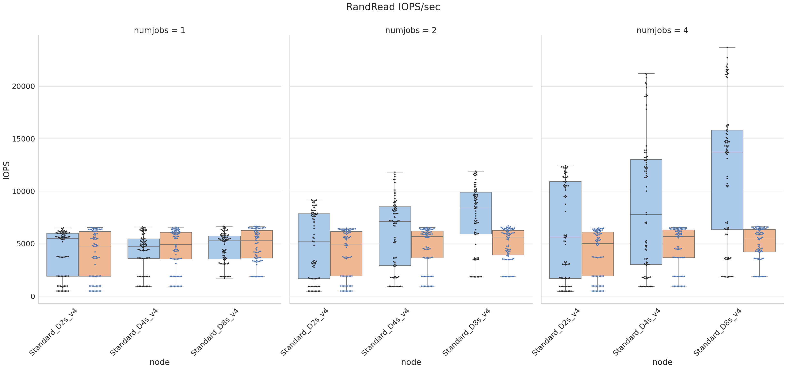
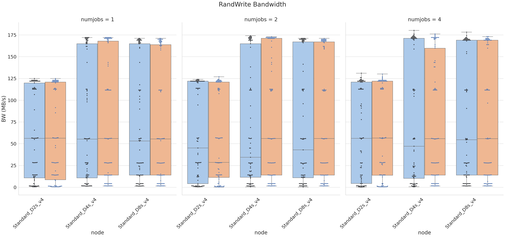
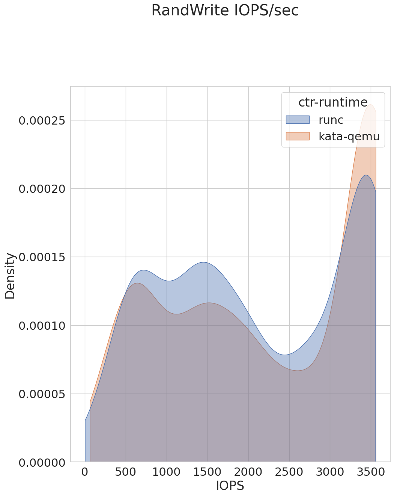

# aks-benchmark-fio
Analysis of IO performance in AKS using fio benchmark tool

# Data Visualizations

## RandRead Bandwidth

 
 
 

## RandRead IOPS

 
 
 

## RandWrite Bandwidth

 
 
 

## RandWrite IOPS

 
 
 
