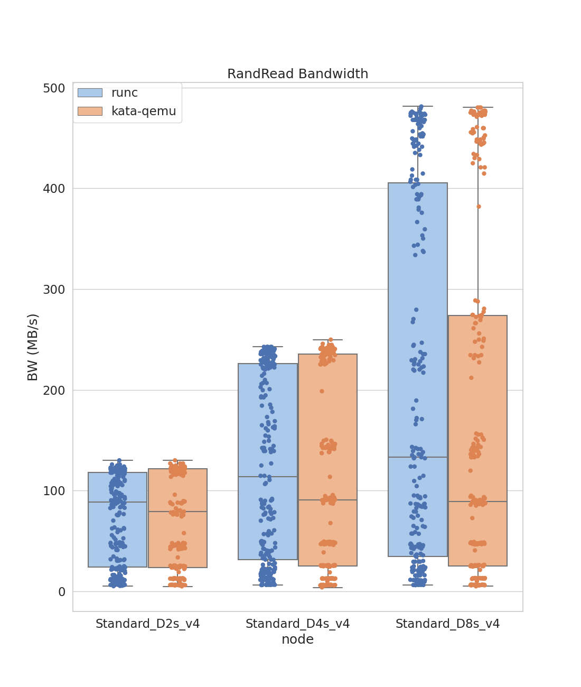
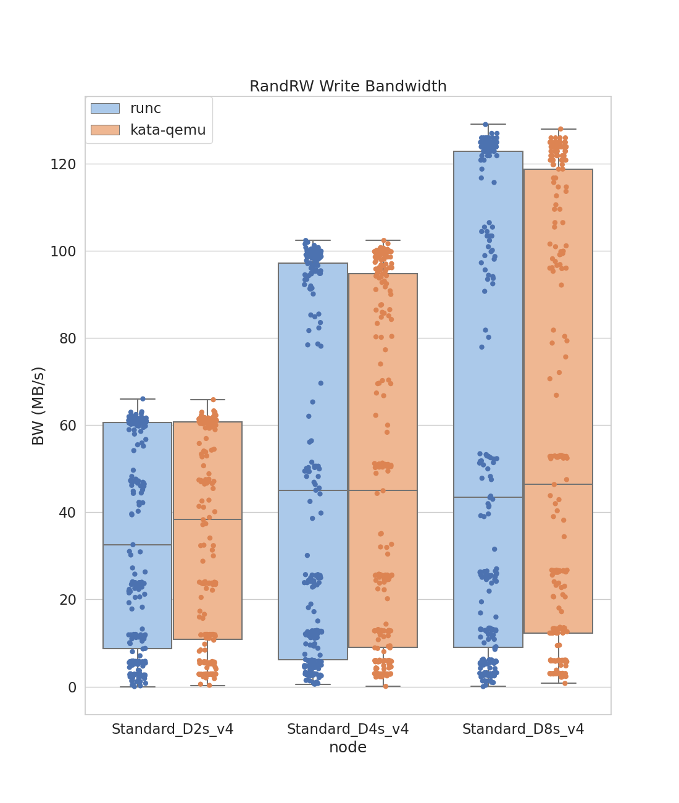

# aks-benchmark-fio
Analysis of IO performance in AKS using fio benchmark tool

# Data Visualizations

## RandRead
### RandRead Bandwidth

 
 
 

### RandRead IOPS

 
 
 

### RandWrite Bandwidth

 
 
 

## RandWrite
### RandWrite IOPS

 
 
 

### RandRW Write Bandwidth

 
 
 

### RandRW Write IOPS

 
 
 

## RandRW Read
### RandRW Read Bandwidth

 
 
 

### RandRW Read IOPS

 
 
 

## RandRW Write
### RandRW Write Bandwidth

 
 
 

### RandRW Write IOPS

 
 
 
